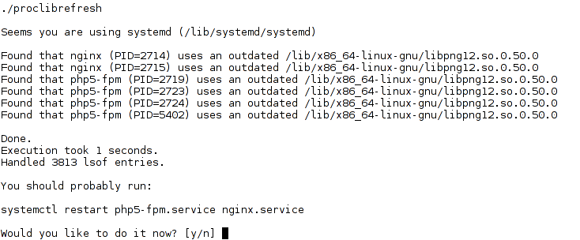

# proclibrefresh

This program uses lsof to find processes that use an outdated or missing library.
It is usefull in case you update widely used lib and want to restart only the affected services.
In case the system is using systemd, it will also suggest which services are affected.

THIS PROGRAM IS MEANT TO BE RUN BY ROOT

This is because lsof's output is very partial with regular user.

To compile:
g++ -Wall -std=c++11 proclibrefresh.cpp -o proclibrefresh

Screenshot:

